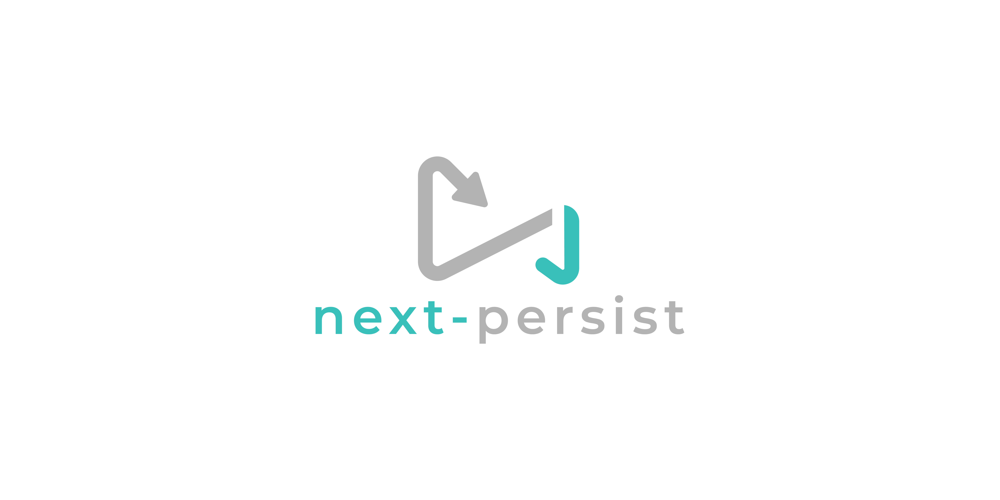
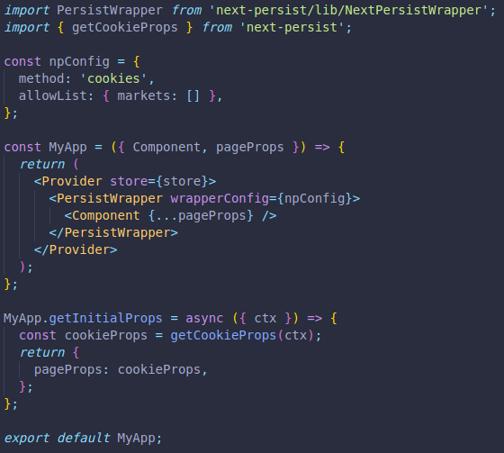

<p align="center">
  
  <br />
  </a>
  <a href="https://github.com/oslabs-beta/next-persist/stargazers">
    
  </a>
  <a href="https://www.npmjs.com/package/next-persist">
    
  </a>
  <a href="https://github.com/oslabs-beta/next-persist/graphs/contributors">
    
  <a href="https://github.com/oslabs-beta/next-persist/blob/main/LICENSE">
    
  </a>
</p>

<h1 align="center">next-persist</h1>
<p align="center">
Bridging the gap between client-side persistence and server-side rendering.
  <br />
    <a href="https://www.mostjs.org">Homepage →</a><br>
    <a href="https://www.mostjs.org/demo">Demo →</a>
</p>

<table>
  <tr>
    <td width="60%">
<p>'What is next-persist?' Well, next-persist is a lightweight NPM package developed to simplify the process of storing and reconciling non-critical persistent client state while retaining the benefits of server side rendering and static site generation provided by Next.js.</p>

<p>Wouldn't it be nice to gain the benefits of Next.js while still providing the users with some sort of dynamic state persistence? How about without worrying about the design and added costs of additional database management systems?
<br>
Well now you can! next-persist provides a simple solution for your dynamic, isomorphic web applications. Just import next-persist, set up a quick config and incorporate our functions. We do the rest, delivering you the benefits of server side rendering and persistent client data.
</p>
   </td>
    <td>
      
    </td>
  </tr>
</table>

<details open="open">
  <summary>Table of Contents</summary>
    <ol>
      <li>
        <a href="#getting-started">Getting Started</a>
        <ul>
          <li><a href="#prerequisites">Prerequisites</a></li>
          <li><a href="#installation">Installation</a></li>
        </ul>
      </li>
      <li>
        <a href="#usage">Usage</a>
        <ul>
          <li><a href="#config">Config</a></li>
          <li><a href="#wrapper">Wrapper</a></li>
          <li><a href="#reducer">Reducer</a></li>
          <li><a href="#cookies">Cookies</a></li>
        </ul>
      </li>
  <!--     <li><a href="#roadmap">Roadmap</a></li> -->
      <li><a href="#contributing">Contributing</a></li>
      <li><a href="#license">License</a></li>
      <li><a href="#maintainers">Maintainers</a></li>
      <li><a href="#built-with">Built with:</a></li>
    </ol>
</details>

---

## Getting Started

To add `<NextPersistWrapper />`, `getStorage`, and `getCookie` to your project, follow these steps.

---

### Prerequisites

- Redux (v. 4.0.5 and up)

  ```
  npm install redux
  ```

- React (v. 16.8.0 and up)
  ```
  npm install react
  ```

---

### Installation

1.  Install next-persist from the terminal.
    ```
    npm install next-persist
    ```
2.  Import `<NextPersistWrapper />` into your frontend at top level of your Next.js app.
    ```
    // _app.js
    import PersistWrapper from 'next-persist/src/NextPersistWrapper';
    ```
3.  If utilizing localStorage to persist client-state:<br>
    Import `{ getStorage }` into your reducer(s) you plan to persist.
    ```
    // yourReducer.js
    import { getStorage } from 'next-persist'
    ```
4.  If utilizing cookies to persist client-state:<br>
    Import `{ getCookie }` into your frontend at the top level of your Next.js app as well as into any reducer(s) you plan to persist.

    ```
    // _app.js
    import { getCookie } from 'next-persist/src/next-persist-cookies'

    // yourReducer.js
    import { getCookie } from 'next-persist/src/next-persist-cookies'
    ```

---

## Usage

### Config

next-persist requires a simple config object allowing you to make changes to the behaviour of our package. First, a **required** `method` key, dictating which storage method you would like to use. Second, an optional `allowList` key holding an object.

```
  //_app.js

  const npConfig = {
    method: 'localStorage' or 'cookies'
    allowList: {
      reducerOne: ['stateItemOne', 'stateItemTwo'],
      reducerTwo: [],
    },
  };
```

The `allowList` key can be setup to allow only certain reducers to store only certain pieces of state to the chosen storage method. The keys on `allowList` have to correspond with the keys of the reducers in `combineReducers()`. To store only certain pieces of state from a reducer, set the value as an array holding the names of the state items as strings. If you wish to store all state from a reducer, set the value as an empty array. If no allowList is provided, **next-persist** will store all state from all reducers to the chosen storage method.

---

### Wrapper

`<PersistWrapper />` requires one prop with the label: `wrapperConfig`, which takes as argument config object that the developer declares in the `_app` component.

```
  Example:

  import { Provider } from "react-redux";
  import store from "../client/store";
  import PersistWrapper from 'next-persist/src/NextPersistWrapper';

  const npConfig = {
    method: 'localStorage'
    allowList: {
      reducerOne: ['stateItemOne', 'stateItemTwo'],
    },
  };

  const MyApp = ({ Component, pageProps }) => {
    return (
      <Provider store={store}>
        <PersistWrapper wrapperConfig={npConfig}>
          <Component {...pageProps} />
        </PersistWrapper>
      </Provider>
    );
  };

  export default MyApp;
```

---

### Reducer

In each reducer file we need to import `getStorage` from `'next-persist'` or or `getCookies` from `'next-persist/src/next-persist-cookies'`.

Declare a constant and assign it the value of the evaluated result of calling `getStorage` or `getCookies` method.

`getStorage` or `getCookies` takes two arguments:

- a string: the reducer key that is saved in storage
- an object: the initial state declared in the reducer file

Pass in the newly declared constant into the reducer as a default parameter for state.

```
  Example:

  import * as types from '../constants/actionTypes';
  import { getStorage } from 'next-persist';
  // or
  // import { getCookies } from 'next-persist/src/next-persist-cookies'

  const initialState = {
    // initialState goes here
    stateItemOne: true,
    stateItemTwo: 0,
    stateItemThree: 'foo',
  };

  const persistedState = getStorage('reducerOne', initialState);
  // or
  // const persistedState = getCookies('reducerOne', initialState);


  const firstReducer = (state = persistedState, action) => {
    // switch case logic in here
    switch (action.type) {
    default:
      return state;
    }
  };

  export default firstReducer;
```

---

### Cookies

Utilizing the cookie storage method offers the benefit of utilizing client state with `getInitialProps`. However it cannot be used to store large amounts of data due to the limits on cookie size.

In this example we invoke `getCookie` in `getInitialProps` and it will return back an object holding all the persisted state values, saved under the key of their reducer name.

```
  Example:

  MyApp.getInitialProps = async (ctx) => {
    const cookieState = getCookie(ctx);
    return {
      pageProps: cookieState,
    };
  }

  export default MyApp;
```

---

## **WARNING** - NEVER STORE UNENCRYPTED PERSONAL DATA TO CLIENT STORAGE

---

## Contributing

If you would like to contribute to next-persist, please [fork this repo](https://github.com/oslabs-beta/next-persist). Commit your changes to a well-named feature branch then open a pull request. We appreciate your contributions to this open-source project!

## License

Distributed under the MIT License. See `LICENSE` for more information.

## Maintainers

- [Brian Chu](https://github.com/darthchu)
- [Christopher Bosserman](https://github.com/christopherpbosserman)
- [Greg Levine-Rozenvayn](https://github.com/grishaLR)
- [Matthew Salvador](https://github.com/mjsalvador)

## Built with:

- [Next.js](https://nextjs.org/)
- [React](https://reactjs.org/)
- [React-Redux](https://react-redux.js.org/)
- the support of [OSLabs](https://github.com/open-source-labs)
