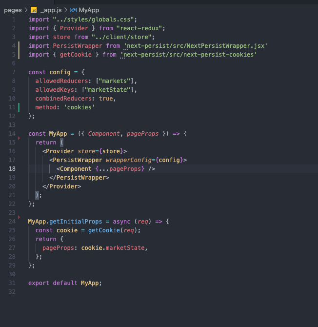

<p align="center">
  
  <br />
  </a>
  <a href="https://github.com/oslabs-beta/next-persist/stargazers">
    
  </a>
  <a href="https://www.npmjs.com/package/next-persist">
    
  </a>
  <a href="https://github.com/oslabs-beta/next-persist/graphs/contributors">
    
  <a href="https://github.com/oslabs-beta/next-persist/blob/main/LICENSE">
    
  </a>
</p>

<h1 align="center">next-persist</h1>
<p align="center">
Bridging the gap between client-side persistence and server-side rendering.
  <br />
    <a href="https://www.mostjs.org">Homepage →</a><br>
    <a href="https://www.mostjs.org/demo">Demo →</a>
</p>

<table>
  <tr>
    <td width="60%">
<p>What is next-persist? next-persist is a lightweight NPM package developed to simplify the process of storing and reconciling non-critical persistent client data while retaining the benefits of server side rendering and static site generation through Next.js.</p>

<p>Wouldn't it be nice to gain the benefits of Next.js while still providing the users with some sort of persistent dynamics? All without worrying about the architecture and costs of additional database management systems?
<br>
Well now you can! next-persist provides a simple solution for your dynamic, isomorphic web applications. Just import next-persist, set up a quick config and incorporate our functions. We do the rest, delivering you the benefits of server side rendering and persistent client data.
</p>

>*“It just works.”  
    -- Kyle Combs*
    </td>
    <td>
      
    </td>
  </tr>
</table>

<details open="open">
  <summary>Table of Contents</summary>
    <ol>
      <li>
        <a href="#getting-started">Getting Started</a>
        <ul>
          <li><a href="#prerequisites">Prerequisites</a></li>
          <li><a href="#installation">Installation</a></li>
        </ul>
      </li>
      <li>
        <a href="#usage">Usage</a>
        <ul>
          <li><a href="#config">Config</a></li>
          <li><a href="#wrapper">Wrapper</a></li>
          <li><a href="#reducer">Reducer</a></li>
          <li><a href="#cookies">Cookies</a></li>
        </ul>
      </li>
  <!--     <li><a href="#roadmap">Roadmap</a></li> -->
      <li><a href="#contributing">Contributing</a></li>
      <li><a href="#license">License</a></li>
      <li><a href="#maintainers">Maintainers</a></li>
      <li><a href="#built-with">Built with:</a></li>
    </ol>
</details>

---

## Getting Started

To add `<NextPersistWrapper />`, `getStorage`, and `getCookie` to your project, follow these steps.

---

### Prerequisites

* Redux (v. 4.0.5 and up)

  ```
  npm install redux
  ```
* React (v. 16.8.0 and up)
  ```
  npm install react
  ```
---


### Installation

1. Install next-persist from the terminal.
    ```
    npm install next-persist
    ```
2. Import `<NextPersistWrapper />` into your frontend at top level of your Next.js app.
    ```
    // _app.jsx
    import PersistWrapper from 'next-persist/src/NextPersistWrapper';
    ```
3. If utilizing localStorage to persist client-state: <br>
Import ` { getStorage } ` into your reducer(s).
    ```
    // yourReducer.jsx
    import { getStorage } from 'next-persist'
    ```
4. If utilizing cookies to persist client-state:<br>
Import ` { getCookie } ` into your frontend at the top level of your Next.js app.
    ```
    // _app.jsx
    import { getCookie } from 'next-persist/src/next-persist-cookies'
    ```

---

## Usage

### Config


...ADDITIONAL TEXT FOR CONFIG GOES HERE...


```
//_app.jsx

const config = {
  method: either 'localStorage' or 'cookies'
  key: 'key that will be saved to localStorage',
  allowList: {
    reducerName: ['allowList', 'forReducer'],
    secondReducer: []
  },
  allowedKeys: ["marketState"],
  combinedReducers: true,
};
```

...MAYBE SOME MORE EXPLAINER TEXT ABOUT CONFIG HERE. DIFFERENCE BETWEEN SINGLE AND COMBINED REDUCERS...

---

### Wrapper

`<PersistWrapper wrapperConfig={YOUR CONFIG HERE}/>` takes one prop that MUST HAVE THE LABEL: ``` wrapperConfig```, which takes as argument configuration object that the developer declares (can be any name) in the _app component. 

    Example: 

    ```
    import "../styles/globals.css";
    import { Provider } from "react-redux";
    import store from "../client/store";
    import PersistWrapper from 'next-persist/src/CookieWrapper.jsx'

    const yourConfigCanBeAnyName = {
      key: 'use this key if single reducer',
      allowlist: ['use this if using single reducer'],
      allowedReducers: ["use, this, key, if, utilizing, combinedReducer"],
      allowedKeys: ["use, this, key, if, utilizing, combinedReducer"],
      combinedReducers: boolean (true if utilizing combinedReducer/ false otherwise),
    };

    const MyApp = ({ Component, pageProps }) => {
      console.log('MyApp pageProps: ', pageProps);
      return (
        <Provider store={store}>
          <PersistWrapper wrapperConfig={yourConfigCanBeAnyName}>
            <Component {...pageProps} />
          </PersistWrapper>
        </Provider>
      );
    };

    export default MyApp;
    ```
---


### Reducer

In each reducer file we need to import `getStorage` from `next-persist`.

Declare a constant and assign it the value of the evaluated result of calling `getStorage` method.

`getStorage` takes two arguments:

* a string that will be the key that is saved on local storage
* an object that is the initial state that is declared in the reducer file

Pass in the newly declared constant into reducer as state.


```
import * as types from '../constants/actionTypes';
import { getStorage } from 'next-persist';

const initialState = {
  // initialState goes here
};


const persistedState = getStorage('demoState', initialState);

const demoReducer = (state = persistedState, action) => {
  let counter;
  let change;
  let lightStatus;
  let initialTime;
  let currentTime;
  let username;
  let userIcon;

   // all your switch case logic in here
    default:
      return state;
  }
};

export default demoReducer;

```


---

### Cookies

Here we will talk about cookies, and maybe put a warning that perissting sensitvie data on cookies isn't the safest.

```
CODE OF _app PAGE THAT SHOWS COOKIES USAGE
```
```
CODE OF reducer PAGE THAT SHOWS COOKIE USAGE
```
We can add more text about cookies here, if we want to.


---

## Contributing

If you would like to contribute to next-persist, please [fork this repo](https://github.com/oslabs-beta/next-persist). Commit your changes to a well-named feature branch then open a pull request. We appreciate your contributions to this open-source project!


## License

Distributed under the MIT License. See `LICENSE` for more information.


## Maintainers

- [Brian Chu](https://github.com/darthchu)
- [Christopher Bosserman](https://github.com/christopherpbosserman)
- [Greg Levine-Rozenvayn](https://github.com/grishaLR)
- [Matthew Salvador](https://github.com/mjsalvador)

## Built with:

* [Next.js](https://nextjs.org/)
* [React](https://reactjs.org/)
* [React-Redux](https://react-redux.js.org/)
* the support of [OSLabs](https://github.com/open-source-labs)